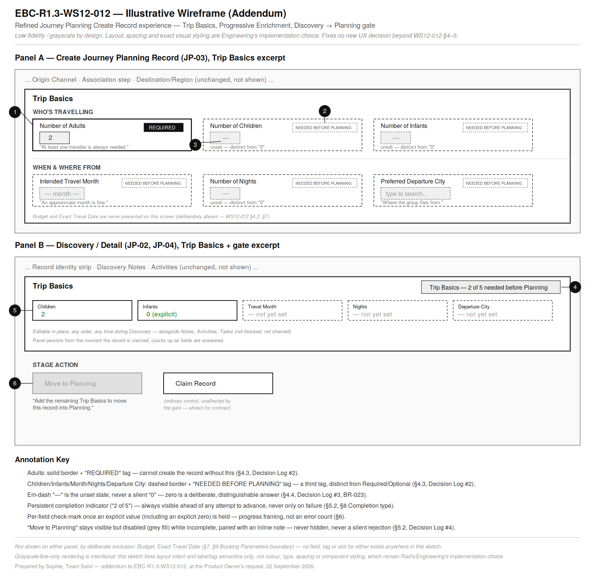

# EBC-R1.3-WS12-012 — Journey Planning UX Refinement: Planning Parameters & Progressive Enrichment

**Persona:** Sophie — Senior UX Designer
**Release:** 1.3
**Workstream:** WS12 — Journey Planning
**Phase:** UX Refinement (not a redesign) — following Product Owner Ratification (`EBC-R1.3-WS12-011B`)
**Status:** UX Refinement Complete — ready for Archie (if architecture confirmation is required), Rad (implementation, new EBC), Keerthi and Sri. **Addendum added 22 September 2026: an illustrative wireframe (Section 15), per Product Owner request following acceptance — see "Addendum History" below.**
**Date:** 22 September 2026

---

**Addendum History**

| Addendum | Date | Trigger | Change |
|---|---|---|---|
| — | 22 September 2026 | Original UX Refinement (this card) | Sections 0–14 as accepted by the Product Owner. |
| 1 | 22 September 2026 | Product Owner request, following acceptance: "add one low-fidelity annotated wireframe ... illustrative only ... must not introduce any new UX or Product decisions ... update the existing WS12-012 deliverable rather than creating a new EBC" | Adds Section 15 (Illustrative Wireframe) and two supporting asset files under `docs/04-UX/journey-planning/`. Sections 0–14 are otherwise unchanged — nothing above is amended, corrected, or superseded by this addendum. |

This is a refinement of the existing Journey Planning UX (`EBC-R1.3-WS12-004`), not a redesign. The existing Workspace UX is the baseline. No Product Analysis, Business Analysis, Architecture, Engineering or QA activity is performed by this card.

---

## 0. Repository Readiness Check (Mandatory — Project Instructions §14/§15)

| Check | Result |
|---|---|
| Repository connected | **Yes.** Folder `/Users/viveksophu/Documents/Projects/SearchMyVacation` |
| Branch | `main` |
| Working tree inspected (read-only) | **Ahead of `origin/main` by 10 commits (not pushed — no push authorised or performed).** 16 files modified and not yet committed, 8 paths untracked — all of it pre-existing WS12-007/010-series engineering and QA work already disclosed by those cards' own reports (History/Tasks UI, Origin Channel, the two pending-then-applied migrations, toast component, and the WS12-010/010V/011A/011B documents themselves). **None of it was created, modified, or touched by this card.** This card is documentation-only: it amends `docs/09-Development/EBC-R1.3-WS12-004-...md` and adds this new file; it does not touch any `web/` or `supabase/` path |
| Destination folder verified | **Yes.** `docs/09-Development/` |
| Files this card will touch | `docs/09-Development/EBC-R1.3-WS12-004-SOPHIE-UX-Design-and-User-Experience-Specification-Journey-Planning.md` (in-place amendment, Revision 2 — supersede-not-delete convention, matching `EBC-R1.3-WS12-003`'s own Revision 2) and this new file. **Addendum 1 additionally adds** `docs/04-UX/journey-planning/EBC-R1.3-WS12-012-Trip-Basics-Create-Record-Wireframe.png` and `...-Wireframe.svg` (new supporting UX artefacts, the optional location `EBC-R1.3-WS12-004` §"Repository Destination" itself names) |
| Commit / push | Not performed by this card without explicit authorisation, per Project Instructions §26 |

---

## 1. Canonical Sources Used (and Not Used)

Per the Product Owner's explicit instruction, this refinement is built exclusively from:

- **`EBC-R1.3-WS12-003` (Revision 2, amended 22 September 2026)** — read in full, current text, directly from the repository (`docs/09-Development/`), not summarised secondhand. Specifically §5 (lifecycle/gate), §6.1 (Planning Parameters sub-group), §7 (`FR-JP-31`–`34`, `36`; superseded `FR-JP-35`), §8 (`BR-020`, `021`, `023`, `024`; superseded `BR-022`), §17 (Forward Allocation to WS13), §19 (RTM).
- **`EBC-R1.3-WS12-011A` (Revision 2)** — specifically its Section 6 business-level UI guidance and Section 4 Lifecycle Requirement Matrix, and its Section 0 confirmation of the actual, current Create-screen field set (see Section 2 below).
- **`EBC-R1.3-WS12-011B`**, including Appendix A (Ratified Product Decisions).

**Not used as design sources**, per instruction: the Revision 1 drafts and proposals inside `EBC-R1.3-WS12-011A` that Revision 2 itself marks superseded (the original two-gate design, the original `FR-JP-35`/`BR-022`). Where this document cites `WS12-011A`, it cites only its ratified, current content.

**Also reviewed (existing UX baseline, not a canonical source for new decisions):** `EBC-R1.3-WS12-004` in its current, committed form, and the actual shipped implementation (Section 2).

---

## 2. Existing UX Reviewed (Updated Journey Planning UX Review)

### 2.1 The WS12-004 specification, as written

Screens JP-01–JP-13 (`EBC-R1.3-WS12-004` §7); the Create flow (§8.1); the Component Catalogue (§11); the Validation Feedback model (§14, four tiers: Success, Warning, Information, Blocking — Blocking "reserved for the small number of cases where the business rules genuinely require it... used sparingly"); the UX Design Decisions (§18, including Decision 4, "the Association step is a single either/or choice," and Decision 5, "duplicate-prevention feedback is surfaced inline during data entry, not as a post-submission rejection"). None of this specification's text has any awareness of Planning Parameters, since the business model containing them did not exist when it was written (19 September 2026, three days before Revision 2).

### 2.2 The actual shipped implementation, as it exists today

Reviewed directly in the repository, not only through prior EBC reports, since Tiger's handover note asks the UX to be grounded in "the existing Workspace experience," and the implementation has diverged from the WS12-004 specification in some respects (per WS12-007's own Known Limitations):

- **Create screen (`NewJourneyPlanningRecordForm.tsx`):** Record Type (Individual/Corporate radio), Title (required), Origin Channel (required, select), Destination Region (optional, free text), then either Traveller Full Name (required)/Traveller Email (optional), or Company Name (required)/Contact Name (required)/Contact Email (optional). **No Planning Parameters field of any kind exists on this screen today.** No duplicate-prevention panel and no inline association-selector component exist either (`EBC-R1.3-WS12-011A` §0 already disclosed this divergence from WS12-004's §8.1/§11; this card does not re-open it, since it is outside this refinement's scope).
- **Detail screen (`JourneyPlanningRecordDetailView.tsx`):** a combined Overview/Discovery/Proposal/History/Tasks view. Stage advancement is a **generic, ungated "Move to `<Stage>`" button loop** — for every one of the seven stages alike, including Discovery → Planning — with no field-completeness check of any kind today. History (JP-09) and Tasks & Follow-ups (JP-12) were added by `WS12-010` and are live. This confirms the Discovery-to-Planning gate this card must design for is genuinely new interaction design, not a refinement of an existing gate.

### 2.3 Implication for this refinement

Because neither the Planning Parameters fields nor any stage-transition gate exist in the shipped UI yet, "refine" in practice means **adding** a small, clearly-scoped piece of new interface (a Planning Parameters panel at creation and in the Detail view, and a completion-aware treatment of one specific stage transition) rather than editing an existing control. This card treats that addition as a refinement of the Create and Detail screens' existing structure — not a new screen, not a new flow shape — consistent with Tiger's "least possible disruption" instruction.

---

## 3. UX Impact Assessment

| Screen | Impact | Classification | Rationale |
|---|---|---|---|
| **JP-03 — Create Journey Planning Record** | Adds Number of Adults as a new mandatory field; adds Children, Infants, Intended Travel Month, Number of Nights, Preferred Departure City as new, clearly-optional-at-this-point fields | **Required refinement** | Directly required by `FR-JP-31`, `33`, `34` and `BR-020` |
| **JP-02 (Overview) / JP-04 (Discovery)** | Adds a persistent Planning Parameters panel (mirroring the creation panel, editable throughout Discovery) and refines the "Move to Planning" control's presentation with contextual completion guidance | **Required refinement** | Directly required by `BR-021`, `023`; Progressive Enrichment (`BR-020`) needs a place to live after creation |
| **JP-01 — Queue** | None | **Intentionally unchanged** | The queue's stage-grouped list and claim mechanics are untouched by the Planning Parameters model; no ratified decision asks the queue itself to surface field-completeness (see Section 9, Future Consideration) |
| **JP-05 — Proposal Workspace** | None | **Intentionally unchanged** | Proposal composition and Vendor Quotation referencing are unaffected; Planning Parameters inform the Proposal's content but do not change how it is authored |
| **JP-06 — Vendor Quotation View** | None | **Intentionally unchanged** | No relationship to Planning Parameters |
| **JP-07 — Proposal History** | None | **Intentionally unchanged** | No relationship to Planning Parameters |
| **JP-08 — Corporate Point of Contact Details** | None | **Intentionally unchanged** | Planning Parameters belong to the Journey Planning Record (§6.1), not to the Traveller/Corporate POC object; no field moves between objects |
| **JP-09 — Planning Activity Timeline / History** | None required this pass | **Intentionally unchanged (see Section 9, Future Consideration)** | The existing "Stage Changed" audit event already captures a successful Discovery→Planning transition; a dedicated "Planning Parameters completed" event would be a reasonable enhancement but is not required by any ratified decision, and adding a new audit event type is an Engineering concern this card does not authorise |
| **JP-10 — Search & Filters** | None | **Intentionally unchanged** | No new filter dimension is ratified |
| **JP-11 — Archive View** | None | **Intentionally unchanged** | No relationship to Planning Parameters |
| **JP-12 — Tasks & Follow-ups** | None | **Intentionally unchanged** | No relationship to Planning Parameters |
| **JP-13 — Confirm / Close Record** | None | **Intentionally unchanged** | Planning Parameters are a Discovery-stage concern; the Closed/Convert moment is unaffected |

**No screen not listed as "Required refinement" above is touched by this card.**

---

## 4. Refined Create Record Experience (JP-03)

### 4.1 What changes

One new field group is added to the existing creation form, placed **after** the Association step and Destination/Region, and **before** the Submit action — it does not disturb the existing Origin Channel → Association → Destination sequence (`EBC-R1.3-WS12-004` §8.1, points 2–5), which this card leaves exactly as it is.

### 4.2 The new field group — "Trip Basics"

User-facing heading: **"Trip Basics"** (plain, warm language for what this card's canonical sources call "Planning Parameters" internally — the internal/documentation term is never shown to a Workspace User, consistent with the Calm Workspace tone).

Two visually grouped sub-sections within one panel — not two separate steps, not a wizard:

**"Who's travelling"**

| Field | Treatment at creation | Input pattern | Helper text |
|---|---|---|---|
| Number of Adults | **Required** | Numeric stepper, minimum 1, starts blank (not pre-filled to 1) | "At least one traveller is always needed." |
| Number of Children | Present, not required | Numeric stepper, starts blank (see Section 4.4 on the zero/blank distinction) | "Add now if you know — you can fill this in later during Discovery." |
| Number of Infants | Present, not required | Numeric stepper, starts blank | Same as Children |

**"When & where from"**

| Field | Treatment at creation | Input pattern | Helper text |
|---|---|---|---|
| Intended Travel Month | Present, not required | Month picker (month + year, no day) | "An approximate month is fine — exact dates come later." |
| Number of Nights | Present, not required | Numeric stepper, starts blank | "Roughly how many nights, even as an estimate." |
| Preferred Departure City | Present, not required | Text field with existing-value typeahead (reusing the Destination/Region field's existing input pattern, not a new component) | "Where the group will be flying from." |

**Deliberately absent from this panel, and from the Create screen entirely:**

- **Budget** — never presented as a field, at creation or anywhere else, per `FR-JP-32`/`BR-020`. This is not a new UX decision; it extends the existing `FR-JP-13` precedent (no "purpose of travel" field) that WS12-004 §14/§18 already established for exactly this kind of deliberate exclusion.
- **Intended Travel Date** (the exact date) — not shown on the Create screen. See Section 6 below for the full rationale; in short, `EBC-R1.3-WS12-011A` §6's own guidance is explicit that "Travel Date carries no such prompt within this module at all," and introducing a date field here — even an optional one — would create exactly the "implies immediate requirement" impression the card's Constraints ask this refinement to avoid.

### 4.3 Visual and terminology treatment — required vs. gated vs. ordinary-optional

Three distinct tags, not two, because a plain "Required"/"Optional" binary would misrepresent the gate:

| Tag | Applies to | Meaning communicated |
|---|---|---|
| **Required** | Number of Adults only | Cannot create the record without this |
| **Needed before Planning** | Children, Infants, Travel Month, Nights, Departure City | Not needed now; will be needed to move this record into Planning |
| *(no tag)* | Destination/Region (existing field, unchanged) | Ordinary optional field, no future requirement attached |

This third tag is the single most important terminology decision in this refinement: it lets the Create screen stay uncluttered and non-demanding (Progressive Enrichment) while being honest that these five fields are not simply "nice to have" — they are a known, upcoming requirement. Presenting them as plain "Optional" would satisfy the letter of "don't overwhelm the user" while quietly setting up a worse surprise later, at the exact moment (Discovery → Planning) the business genuinely needs the answer.

### 4.4 The explicit-zero problem (`BR-023`)

Children, Infants and Nights are numeric fields where **zero is a legitimate, meaningful answer** ("this trip has no children") and must be distinguishable from **not yet answered**. A stepper that silently starts at `0` would collapse this distinction and defeat the purpose of `BR-023` before the record is a minute old.

**Recommendation:** each of these three steppers starts in a visually distinct **unset** state (shown as an em-dash or "—" rather than "0"), with the stepper's own `–`/`+` controls only becoming active once the field has been touched; a small inline "Set to 0" affordance sits beside the stepper for the common case of a traveller confirming there genuinely are none, so answering "zero" takes one deliberate action, not zero actions. This is a component-level behaviour, not a new component — the existing numeric stepper pattern is extended with an unset state, not replaced.

### 4.5 What does not change

The existing Origin Channel selection, the Association step (`EBC-R1.3-WS12-004` §8.1 point 3, UX Decision 4), the duplicate-prevention pattern (point 4, Decision 5), and the Submit-disabled-until-association-resolved blocking rule (point 6) are all untouched by this card. Trip Basics does not gate Submit in any way — the record can be created with only Adults answered, exactly as `FR-JP-33` requires.

---

## 5. Discovery → Planning Gate (Refined Interaction Flow)

### 5.1 The problem this section solves

`BR-021` is a genuine, business-required block — Discovery cannot exit to Planning without all five named parameters holding an explicit value. This is qualitatively different from every other stage transition in Journey Planning, which is governed only by the Owner's business judgement (Section 5, `EBC-R1.3-WS12-003`). The refinement's job is to make this one transition feel like guided completion, not like hitting a wall — without pretending the requirement isn't real.

### 5.2 Refined design

On the Detail screen (JP-02/JP-04), the Trip Basics panel from Section 4 reappears — the same fields, the same grouping and terminology, now editable in place at any time during Discovery (autosave, matching the existing in-place edit pattern already used for requirement fields, `EBC-R1.3-WS12-004` §8.2 — no new editing paradigm is introduced).

A small, persistent **completion indicator** sits with the panel from the moment the record is claimed, not only when the Owner tries to advance:

> *Trip Basics — 2 of 5 needed before Planning*

Each of the five fields carries a quiet check-mark once it holds an explicit value (including an explicit zero); the indicator counts up as the Owner fills things in, whenever they choose to, in whatever order they choose.

The **"Move to Planning" action** (part of the existing generic stage-advance control, `EBC-R1.3-WS12-004` §8.1's structural pattern, not a new control) behaves as follows:

- While any of the five fields is unanswered, "Move to Planning" is present and visible (never hidden — an Owner should always be able to see where they're heading), but **disabled**, with a one-line inline note directly beneath it: *"Add the remaining Trip Basics to move this record into Planning."* Clicking the disabled control (or hovering, on desktop) surfaces the same completion indicator from the panel above, so the "why" is never more than one glance away.
- Once all five hold an explicit value, "Move to Planning" becomes enabled with no further change in position, styling, or copy — it simply joins the other always-available "Move to `<Stage>`" actions the Owner already uses for every other transition.

This mirrors the existing Blocking-validation precedent WS12-004 already established for the Association step at creation ("Submit is disabled until... unambiguous," §14) — the mechanism is not new, only its second application. What is new, and what directly answers this card's "avoid disruptive validation" instruction, is that the *reason* is always visible ahead of time via the completion indicator, rather than only appearing as a rejection at the moment of the attempt.

### 5.3 Explicitly not done

No modal dialog, no full-page validation summary, and no blocking error toast is introduced anywhere in this flow. The disabled-button-plus-always-visible-indicator pattern is the entire mechanism — consistent with `EBC-R1.3-WS12-004` §14's existing instruction that blocking validation, where genuinely required, should still be "used sparingly" and presented calmly.

---

## 6. Progressive Enrichment

`BR-020` is expressed in the UX two ways, both already implicit in Sections 4–5 and stated explicitly here for completeness:

1. **At creation**, only Adults is asked for. Nothing about the interface implies the other five fields must be completed before the Owner can start working the record.
2. **During Discovery**, the same five fields can be completed in any order, at any pace, alongside — not instead of — every other Discovery activity (notes, activities, Tasks, Follow-ups). The completion indicator (Section 5.2) is deliberately framed as progress ("2 of 5"), not as an outstanding-errors count, and never appears in a colour or iconography that reads as a warning while the record is still in Discovery. It only takes on a more pointed tone (the inline note beneath the disabled button) at the specific moment the Owner actually attempts the Planning transition — not before.

---

## 7. Booking Parameters Boundary (Exact Travel Date)

Per `FR-JP-36`/`BR-024` and the Forward Allocation to WS13 (`EBC-R1.3-WS12-003` §17), Exact Travel Date is not part of Journey Planning's own UX in this refinement:

- It does not appear on the Create screen (Section 4.2).
- It does not appear in the Trip Basics panel or the completion indicator (Section 5.2) — it is not one of the five gated fields, and giving it a slot beside them would visually imply it belongs to the same requirement, which it explicitly does not.
- No date-picker, calendar control, or "confirm your travel dates" prompt of any kind is introduced anywhere in Journey Planning's screens by this card.
- If a future card needs to reference the eventual booking step from within Journey Planning (for example, a note on JP-13 at Confirmed closure), any such reference must name it as belonging to Journey Workspace (WS13) and must not resemble a data-entry field — that is a future consideration (Section 9), not built here.

This is a small but deliberate act of restraint: the easiest implementation path would have been to add Travel Date to the Trip Basics panel as a sixth "optional" field, since the data model (§6.1) does track it. This card recommends against that, because doing so would blur exactly the boundary `BR-024` and the Forward Allocation note exist to protect.

---

## 8. Validation Experience — Summary

No new validation *type* is introduced beyond `EBC-R1.3-WS12-004` §14's existing four tiers (Success, Warning, Information, Blocking). This refinement's only addition is a **Completion** presentation of the existing Information tier — the "2 of 5" indicator and per-field check-marks — which is informational, not corrective, until the one Blocking case described in Section 5.2. No modal, no page-level banner, no disruptive interrupt is used anywhere in this refinement, consistent with the card's explicit instruction.

---

## 9. Consistency Review

- **Calm Workspace / minimal cognitive load:** preserved — one new panel, reusing existing field-level patterns (stepper, typeahead, month picker framed as a lightweight date control), no new screen, no new navigation entry.
- **Progressive disclosure:** preserved and reinforced — Trip Basics is the clearest existing example yet of "ask only what's needed now, invite the rest later."
- **Existing Workspace component consistency:** no new component library, colour token, or typography value is introduced; the numeric stepper's unset-state extension (Section 4.4) is the only new interaction primitive, and it is a small, additive change to an existing pattern rather than a new one.
- **Existing interaction model:** the generic "Move to `<Stage>`" control (Section 5.2) keeps its existing shape and position for every stage, including Planning; only its enabled/disabled state and the adjacent inline note are new.

**Future considerations (not required by this card, recorded for Tiger's backlog judgement):**

- A subtle Trip-Basics-completeness signal on the Queue (JP-01) row/card, so an Owner can see at a glance which of their Discovery-stage records still need attention, without opening each one.
- A dedicated "Planning Parameters completed" audit event on the Timeline (JP-09), distinct from the existing "Stage Changed" event, for reporting purposes.
- Whether/how a future WS13 Booking Parameters panel should visually echo this card's Trip Basics panel for continuity — explicitly WS13's own design decision, not pre-empted here.

---

## 10. UX Decision Log

| # | Decision | Rationale |
|---|---|---|
| 1 | Trip Basics is one panel with two labelled sub-groups (composition; trip shape & departure), not a multi-step wizard | Matches `BR-021`'s own two logical clusters; avoids adding a new multi-step creation flow the existing screen doesn't otherwise have |
| 2 | A third tag, "Needed before Planning," is introduced alongside Required/no-tag | A plain Optional/Required binary would misrepresent that these five fields carry a real future requirement; see Section 4.3 |
| 3 | Children/Infants/Nights steppers start unset (not defaulted to 0), with a deliberate "Set to 0" affordance | Directly required by `BR-023`'s explicit-value/tri-state integrity rule — a silent zero default would defeat the rule's purpose |
| 4 | "Move to Planning" stays visible but disabled while incomplete, paired with an always-visible completion indicator, rather than being hidden or only failing on click | Extends the existing Blocking-validation precedent (Association step, WS12-004 §14/§18) rather than inventing a new one, while answering this card's "avoid disruptive validation" instruction by surfacing the reason ahead of the attempt, not only after it |
| 5 | Exact Travel Date is not surfaced anywhere in Journey Planning's UI, including as an "optional" field | Protects the `BR-024`/Forward-Allocation boundary to WS13; adding it as a sixth optional field was the easier but boundary-blurring option, and is explicitly rejected |
| 6 | The internal term "Planning Parameters" is never shown to a Workspace User; the on-screen label is "Trip Basics" | Keeps the panel's language warm and plain, consistent with the project's Calm Workspace / non-technical tone principle; the canonical documents' own terminology is a business/documentation concern, not a UI copy requirement |
| 7 | No new screen, route, or navigation entry is introduced; Trip Basics is added to the existing Create and Detail screens only | Matches Tiger's "least possible disruption" instruction and the card's own "not a redesign" framing |

---

## 11. UX Change Summary

**Added:** a "Trip Basics" field group (Adults required; Children, Infants, Travel Month, Nights, Departure City present-not-required) on the Create screen (JP-03); the same panel, editable in place with a completion indicator, on the Detail screen (JP-02/JP-04); a disabled/enabled treatment plus inline guidance on the existing "Move to Planning" action; a "Needed before Planning" field tag distinct from Required/Optional; an unset-vs-zero state for the three zero-valid numeric fields.

**Changed:** nothing about the existing Origin Channel, Association, duplicate-prevention, Destination/Region, Proposal, Vendor Quotation, Task/Follow-up, History, Search, Archive, or Close/Convert flows.

**Explicitly not introduced:** a Budget field; an Exact Travel Date field or prompt anywhere in Journey Planning; a wizard-style multi-step creation flow; a modal or page-level validation interrupt; a new screen or navigation entry; any change to Business Rules, Functional Requirements, architecture, database design, or implementation.

---

## 12. Verification Against This Card's Own Requirements

| Requirement | Confirmed |
|---|---|
| UX reflects the ratified Product baseline | Yes — every field, gate and boundary in Sections 4–7 traces to a specific `FR-JP-3x`/`BR-02x` |
| Progressive Enrichment is intact | Yes — Section 6; only Adults is ever required, at any point |
| Discovery → Planning gate is understandable to the user | Yes — Section 5.2's always-visible completion indicator and inline note |
| Planning Parameters are clearly presented | Yes — Section 4.2–4.3, with a distinct visual/textual treatment per requirement tier |
| Booking Parameters remain outside WS12 | Yes — Section 7; Exact Travel Date appears nowhere in this refinement's UI |
| Existing Workspace interaction model is preserved | Yes — Section 9; no new component library, screen, or navigation shape |

---

## 13. Explicit Constraints Compliance

This card confirms it has **not**: redesigned Journey Planning; altered any approved Product decision; introduced a new Functional Requirement or Business Rule; modified architecture; changed database design; changed implementation; introduced a new Open Question; introduced a new Product Decision. Every field, gate and label decision above is a UX representation of an already-ratified `FR-JP-3x`/`BR-02x`/Appendix A row — none originates a new business rule.

---

## 14. Deliverables and Handover

- This document (UX Refinement Recommendations, UX Decision Log, UX Change Summary, UX Impact Assessment — Sections 3, 4–8, 10, 11).
- In-place Revision 2 amendment to `EBC-R1.3-WS12-004` (Updated Journey Planning UX Review, Updated Interaction Flow, Updated Screen Notes) — see the companion amendment, applied to §7 (Screen Inventory, JP-03/JP-04 rows), §8.1 (Create flow), §11 (Component Catalogue, new components), §14 (Validation Feedback, new Completion presentation), §18 (two new UX Design Decisions), §19 (one new UX Risk) of that document. All other sections of WS12-004 are untouched.
- **Addendum 1:** the illustrative wireframe and its source file (Section 15).
- **Recommended next steps:** Archie to confirm (if needed) that the Trip Basics field set requires no architecture beyond what WS12-005/007 already anticipated in the Journey Planning Record schema (Section 6.1's Planning Parameters were already named in the Revision 2 business analysis Rad has seen); Rad to implement under a new EBC (not this one), using Section 15's wireframe alongside Sections 4–5's written specification, the wireframe illustrates, it does not supersede or add to the written spec; Keerthi to validate the gate's actual blocking behaviour and the explicit-zero handling at runtime; Sri to review the Trip Basics panel's tone and the gate's inline copy for warmth and clarity once built.

---

## 15. Illustrative Wireframe (Addendum 1 — Product Owner Request, 22 September 2026)

Following acceptance of this EBC, the Product Owner asked for one low-fidelity, annotated wireframe to give Engineering and QA a visual reference for four elements this card already specifies in words: the Trip Basics grouping (§4.2), the Required vs. "Needed before Planning" tag treatment and the unset-vs-zero state (§4.3–4.4), the Discovery → Planning completion indicator (§5.2), and the disabled-but-visible "Move to Planning" control (§5.2).

**Deliverable:** `docs/04-UX/journey-planning/EBC-R1.3-WS12-012-Trip-Basics-Create-Record-Wireframe.png` (rendered, embedded below) and its editable source, `...-Wireframe.svg`, both new files under the optional supporting-artefact location `EBC-R1.3-WS12-004` itself names ("Repository Destination" — `docs/04-UX/journey-planning/`).

**What it shows — Panel A (Create, JP-03):** the Trip Basics panel exactly as specified in §4.2 — Number of Adults with a solid border and a "REQUIRED" tag; Children, Infants, Intended Travel Month, Number of Nights and Preferred Departure City with dashed borders and "NEEDED BEFORE PLANNING" tags (§4.3); the three zero-valid numeric fields (Children, Infants, Nights) shown in their unset ("—") state rather than a silent "0" (§4.4, `BR-023`). Budget and Exact Travel Date appear nowhere on the sketch, matching their deliberate absence from the actual screen (§4.2, §7).

**What it shows — Panel B (Discovery / Detail, JP-02/JP-04):** the same Trip Basics panel mid-completion (2 of 5 answered, including an explicit zero for Infants, distinguished visually from the three still-unset fields); the persistent completion indicator ("Trip Basics — 2 of 5 needed before Planning," §5.2); and "Move to Planning" rendered visible-but-disabled with its inline note directly beneath, set beside an ordinary, unaffected control ("Claim Record") to make clear that only this one transition carries a gate — every other stage action behaves exactly as `EBC-R1.3-WS12-004` §8.1's structural pattern already describes.

**Explicit scope of this artefact:**

- Illustrative only. It fixes no new UX decision, field, label, or interaction beyond what Sections 4–5 and the Decision Log (Section 10) above already specify — every element on the sketch traces to a section already written and accepted; nothing on it should be read as adding to that specification.
- Deliberately grayscale and line-only, not styled to the SMV brand system (colour, typography, spacing, component treatment) — that remains Rad's/Engineering's implementation choice against the existing Workspace design language (`EBC-R1.3-WS12-004` §11), not something this sketch decides. The annotation key on the artefact itself says so explicitly.
- Introduces no new Functional Requirement, Business Rule, Product Decision, or Open Question. Sections 0–14 above are unchanged by this addendum — nothing in them is amended, corrected, or superseded.

---

*Prepared by Sophie, UX, UI and Frontend Experience Specialist, Team Satvi, per EBC-R1.3-WS12-012.*

Co-Authored-By: Claude Sonnet 5 <noreply@anthropic.com>
Claude-Session: https://claude.ai/code/session_011Y2sA4EkWgdhYQCx5tUcyN
